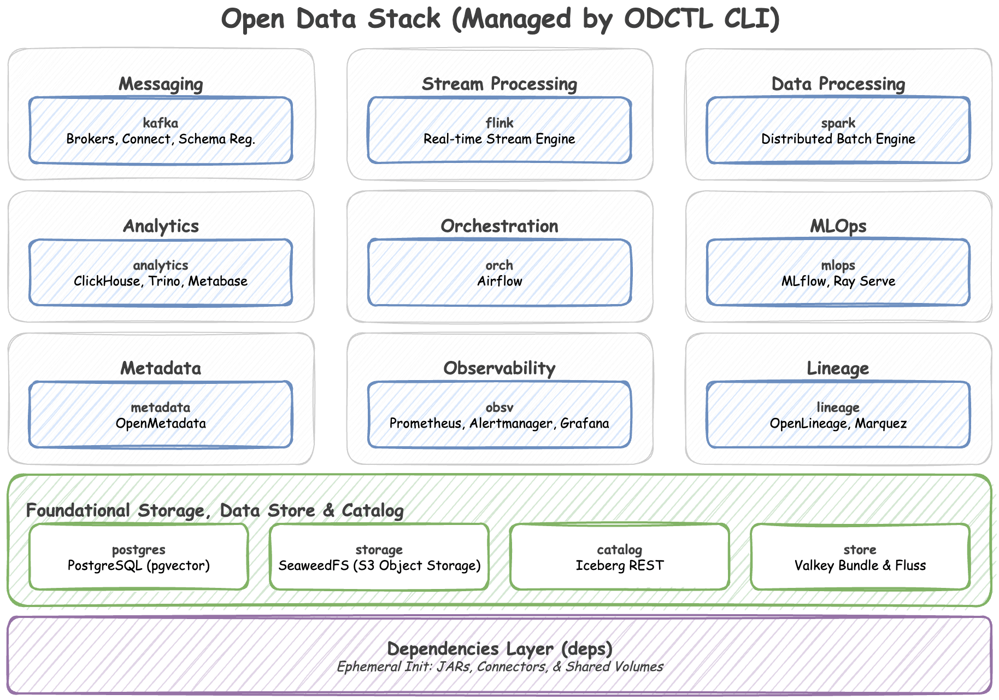

# Open Data Stack




A curated collection of open-source technologies and an accompanying CLI (`odctl`) for experimenting with modern data architecture and MLOps locally.

Provisioning a local data environment with distributed systems can be highly complex. The Open Data Stack streamlines this process by resolving dependency conflicts, network routing configurations, and integration challenges across tools like Kafka, Spark, Flink, Iceberg, and Airflow. It provides a cohesive, Docker-based blueprint that operates seamlessly out of the box.

## Bundled Technologies

The stack is organized into distinct profiles that can be launched independently or together:

- **Event Streaming:** Kafka (KRaft), Schema Registry (Karapace), Kafka Connect
- **Processing Engines:** Apache Spark, Apache Flink
- **Storage & Catalog:** SeaweedFS (S3-compatible), Iceberg REST Catalog, ClickHouse, PostgreSQL (pgvector), Valkey, Apache Fluss
- **Orchestration & MLOps:** Apache Airflow, MLflow, Feast Feature Store
- **Federation & BI:** Trino, Metabase
- **Governance & Observability:** OpenMetadata, Marquez (Lineage), Prometheus, Grafana

## Prerequisites & Installation

### Requirements

- **Docker:** Docker Engine or Docker Desktop must be running. We highly recommend allocating at least 8GB to 16GB of RAM to Docker, as data processing engines are resource-heavy.
- **Python:** Version 3.10 or higher.

### Installation

Since `odctl` is a CLI tool, it is highly recommended to install it in an isolated environment using `uv tool` or `pipx`.

**Using uv (Recommended):**

```bash
uv tool install odctl
```

**Using pipx:**

```bash
pipx install odctl
```

**Using pip:**

```bash
pip install odctl
```

## Quick Start

Get your local cluster up and running in three simple steps.

**1. Initialize your workspace**
This command copies the default Docker Compose files and configurations into a hidden `.odctl` folder in your current directory.

```bash
odctl init
```

**2. Explore available profiles**
See a full list of technologies you can launch.

```bash
odctl list
```

**3. Launch the streaming and batch processing engines**
Bring up a robust data engineering environment.

```bash
odctl up kafka flink1 spark
```

_Note: You do not need to memorize dependencies. The CLI will automatically detect that these profiles require foundational infrastructure and will launch PostgreSQL, SeaweedFS (S3), and the Iceberg REST Catalog for you before starting the target compute engines._

## CLI Command Reference

The `odctl` CLI orchestrates the Open Data Stack and is logically grouped by functionality. You can append `--help` to any command for deeper parameter details.

### Global Options

- `--verbose`: Enable debug-level logging across all commands.
- `-w, --workspace PATH`: Path to the ODCTL workspace directory (default: `./.odctl`).

### Inspection & Info

- `odctl list`: List all available profiles and their capabilities.
- `odctl explain <profile>`: Explain the details, services, images, and dependencies of a profile.
- `odctl ps`: List Docker containers managed by the Open Data Stack.
- `odctl info`: View package and system-wide Docker daemon health status.

### Workspace

- `odctl init`: Initialize a local `.odctl` workspace for custom configurations.

### Cluster Lifecycle

- `odctl pull`: Pre-fetch Docker images without starting the containers.
- `odctl up`: Launch Open Data profiles (automatically resolves upstream dependencies).
- `odctl down`: Stop and remove profile containers and networks.

### Data Operations

- `odctl iceberg`: Execute PyIceberg CLI commands natively within the stack.

### Management

- `odctl logs`: Fetch the logs of containers managed by specific profiles.
- `odctl restart`: Restart one or more specific profiles.

### Examples

```bash
# View all profiles and exposed ports
$ odctl list -d

# See exactly what the kafka profile provisions
$ odctl explain kafka

# Launch specific profiles and their dependencies
$ odctl up flink1 kafka spark

# Complete teardown and wipe all data
$ odctl down --all --volumes
```

## Workspace Customization (.odctl)

The Open Data Stack is designed to be fully hackable. When you run `odctl init`, a local `./.odctl/` workspace is generated in your current working directory.

This folder contains all the underlying configurations that power the stack:

- `compose-*.yml`: The actual Docker Compose definitions. You can edit these to change exposed ports, adjust memory limits, or inject new environment variables.
- `registry.yml`: The internal dependency graph.
- `.env`: The environment variables used across the stack (e.g., default credentials or timezones).

The CLI will always prioritize the files in your local `./.odctl/` directory. If you make a mistake, you can always revert to the pristine default state by running `odctl init --force`.

## Local Development & Contributing

If you want to contribute to the CLI itself, we welcome pull requests!

1. Clone the repository.
2. Install [uv](https://docs.astral.sh/uv/) for dependency management.
3. Sync the dependencies and install the project in development mode:
   ```bash
   uv sync
   ```
4. Install the pre-commit hooks to ensure formatting checks pass:
   ```bash
   uv run pre-commit install
   ```
5. Run the test suite:
   ```bash
   uv run pytest tests/
   ```

## License

This project is licensed under the Apache License 2.0. See the [LICENSE](LICENSE) file for details.
