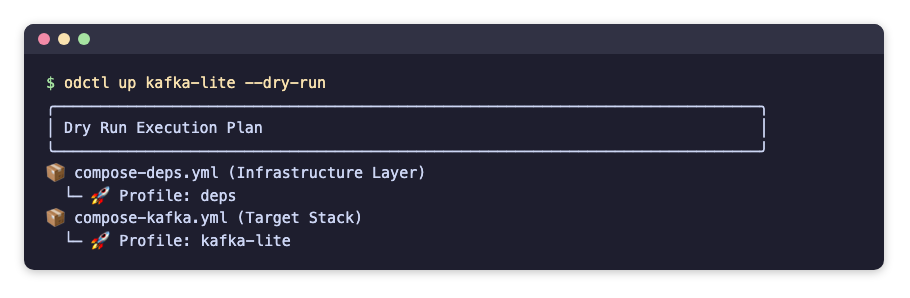

# Getting started

## Requirements

- Docker Engine or Docker Desktop, running. Give Docker 8 to 16 GB of memory.
- Python 3.10 or later.

## Install

odctl is a command-line tool, so install it into its own environment with uv or pipx.

```bash
uv tool install odctl
# or
pipx install odctl
```

`pip install odctl` also works.

## Create a workspace

```bash
odctl init
```

This copies the compose files and their settings into `.odctl` in the current directory, and writes `.odctl/.env` with `TAG` set to the CLI version. odctl reads from `.odctl` whenever it exists, so you can edit any file there. [Workspace](how-it-works.md#workspace) explains what changes with and without it, and how to customise it.

## Start a profile

List the profiles, then see what one of them starts:

```bash
odctl list
odctl up kafka-lite --dry-run
```

The dry run prints which compose files and profiles it would start:

{ .screenshot }

Start it:

```bash
odctl up kafka-lite
```

odctl starts the profiles `kafka-lite` depends on first, then Kafka. It waits until the services are running, and healthy where they define a health check. `odctl explain kafka-lite` prints its addresses, and the [Messaging page](profiles/messaging.md#kafka-lite) lists the same.

Check what is running, and stop everything when you are done:

```bash
odctl ps --all
odctl down --all
```

`odctl down` removes the containers, and the data inside them goes with them. See [How it works](how-it-works.md).
