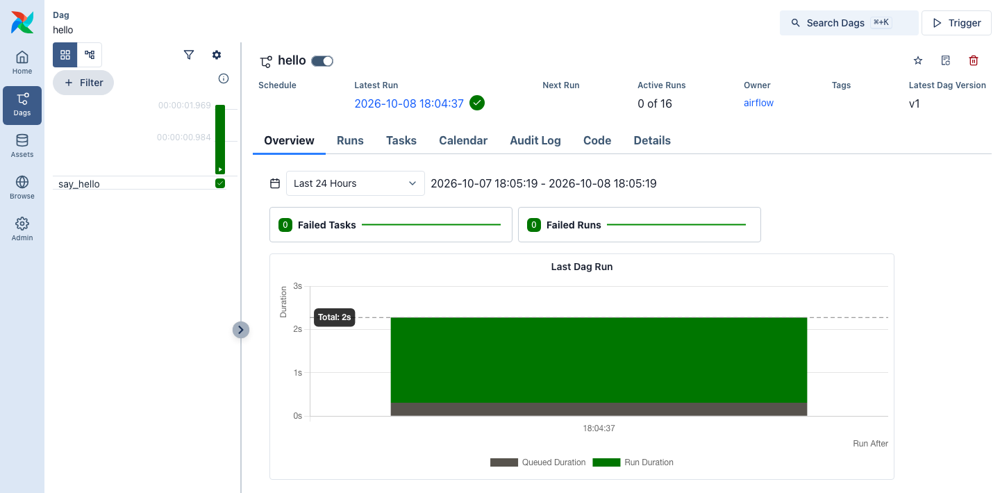

# Airflow DAGs from S3

The `airflow` profile runs `airflow standalone` in one container against odctl's PostgreSQL. It reads DAG files from `s3://airflow/dags` on SeaweedFS, so you deploy a DAG by uploading it. No volume or sync container is involved. The steps below come from the end-to-end tests.

```bash
odctl up airflow
```

The web UI is at `http://127.0.0.1:8085`, with user `user` and password `password`.

## Upload a DAG

Any S3 client pointed at `http://127.0.0.1:8333` with key `user` and secret `password` can upload. This uses boto3 inside the Airflow container:

```bash
docker exec -i airflow python - <<'PY'
import boto3
body = '''
from airflow.sdk import DAG
from airflow.providers.standard.operators.bash import BashOperator
import pendulum

with DAG(
    dag_id="hello",
    start_date=pendulum.datetime(2026, 1, 1, tz="UTC"),
    schedule=None,
    catchup=False,
):
    BashOperator(task_id="say_hello", bash_command="echo hello")
'''
boto3.client("s3", endpoint_url="http://seaweed:8333").put_object(
    Bucket="airflow", Key="dags/hello.py", Body=body.encode())
PY
```

Airflow checks the bucket every 15 seconds and then parses the new file.

## Run it

New DAGs start paused. Wait until the DAG is listed, then unpause and trigger it:

```bash
docker exec airflow airflow dags list | grep hello
docker exec airflow airflow dags unpause hello
docker exec airflow airflow dags trigger hello
docker exec airflow airflow dags list-runs hello
```

The DAG page shows the run and the `say_hello` task.

{ .screenshot }

## Plugins and packages

Plugins are copied from `s3://airflow/plugins` when the container starts, because Airflow loads plugins only once. Run `odctl restart airflow` after changing one.

To install extra Python packages, set `_AIRFLOW_PIP_DEPS` in `.odctl/.env`, for example `_AIRFLOW_PIP_DEPS="scikit-learn"`, and run `odctl recreate airflow`. Tasks already have the MLflow and Feast clients, and `MLFLOW_TRACKING_URI` points at the `mlflow` profile.
