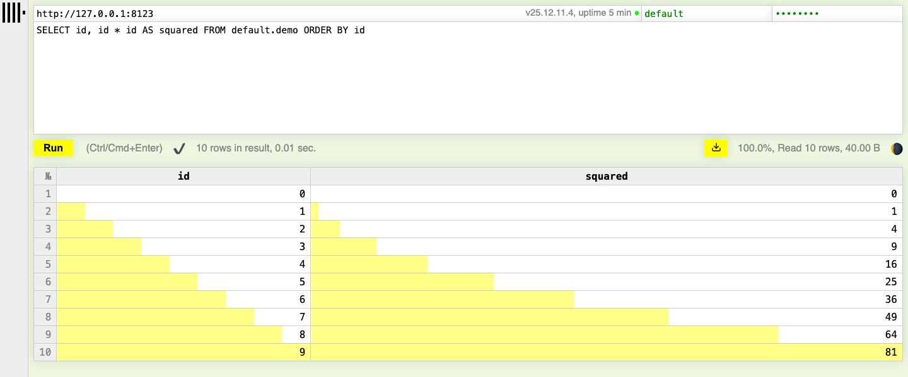

# ClickHouse

The `ch-lite` profile runs one shard with two replicas, `ch-11` and `ch-12`, coordinated by ClickHouse Keeper in `ch-keeper`. `ch-full` adds a second shard, `ch-21` and `ch-22`. The commands below come from the end-to-end tests, with the names changed.

```bash
odctl up ch-lite
```

| Endpoint | Address |
| --- | --- |
| HTTP from the host | `http://127.0.0.1:8123` (`ch-11`) and `http://127.0.0.1:8124` (`ch-12`); `ch-full` adds `8125` (`ch-21`) and `8126` (`ch-22`) |
| Native protocol from the host | `127.0.0.1:9000` (`ch-11`) and `127.0.0.1:9001` (`ch-12`); `ch-full` adds `9002` (`ch-21`) and `9003` (`ch-22`) |
| Users | `default` and `user`, both with the password `password` |

Every server creates the `feature_store` and `odctl` databases when it starts with no data.

## Create a table and query it

`clickhouse-client` is in each server container:

```bash
docker exec ch-11 clickhouse-client --password password -q "SHOW DATABASES"

docker exec ch-11 clickhouse-client --password password -q \
  "CREATE TABLE default.demo (id UInt32) ENGINE=MergeTree ORDER BY id"
docker exec ch-11 clickhouse-client --password password -q \
  "INSERT INTO default.demo SELECT number FROM numbers(10)"
docker exec ch-11 clickhouse-client --password password -q \
  "SELECT count() FROM default.demo"
```

The last command prints `10`.

ClickHouse also serves a query page at `http://127.0.0.1:8123/play`. Enter `default` and `password` in the top right, write a query and press Run.

{ .screenshot }

## Replicate across the cluster

In `ch-full`, `{cluster}` names `odctl_cluster`, which has two shards of two replicas. A table created `ON CLUSTER` with `ReplicatedMergeTree` is created on all four servers, and Keeper keeps the two replicas of each shard in step:

```bash
odctl up ch-full

docker exec ch-11 clickhouse-client --password password -q \
  "CREATE TABLE default.repl ON CLUSTER '{cluster}' (id UInt32) ENGINE=ReplicatedMergeTree ORDER BY id"
docker exec ch-11 clickhouse-client --password password -q \
  "INSERT INTO default.repl SELECT number FROM numbers(50)"

docker exec ch-12 clickhouse-client --password password -q "SELECT count() FROM default.repl"
docker exec ch-21 clickhouse-client --password password -q "SELECT count() FROM default.repl"
```

`ch-12`, the other replica of shard 1, returns `50` once replication has caught up. `ch-21` returns `0`, because shard 2 holds only the rows written to it.

In `ch-lite`, `{cluster}` names `odctl_single_shard`, which holds `ch-11` and `ch-12` only, so `ON CLUSTER` statements finish without waiting for the missing shard.

## From another container

Inside the `odctl` network, connect to `ch-11:8123` over HTTP or `ch-11:9000` with the native protocol, with the same users. Trino's `clickhouse` catalog reads the `feature_store` database on `ch-11`, as [Trino and Metabase](trino-metabase.md) shows.
