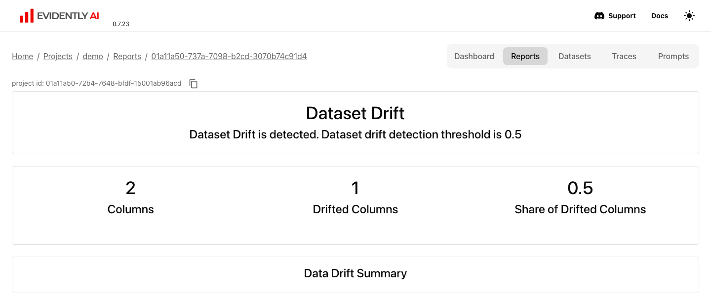

# Evidently reports

The `evidently` profile runs the Evidently UI and API. It keeps projects, reports, dashboards and datasets in the `evidently` database on PostgreSQL. The client computes each report and pushes the result. The code below comes from the end-to-end tests.

```bash
odctl up evidently
pip install evidently==0.7.23
```

The server runs Evidently 0.7.23, so install the same client version. The UI is at `http://127.0.0.1:8089`, with no login.

## Push a data drift report

```python
import numpy as np, pandas as pd
from evidently import Report
from evidently.presets import DataDriftPreset
from evidently.ui.workspace import RemoteWorkspace

ws = RemoteWorkspace("http://127.0.0.1:8089")
project = ws.create_project("demo")

rng = np.random.default_rng(7)
reference = pd.DataFrame({"x": rng.normal(0, 1, 500), "y": rng.normal(0, 1, 500)})
current = pd.DataFrame({"x": rng.normal(3, 1, 500), "y": rng.normal(0, 1, 500)})

snapshot = Report([DataDriftPreset()]).run(current_data=current, reference_data=reference)
ws.add_run(project.id, snapshot)
```

Column `x` moves by three standard deviations and `y` does not, so the report in the UI shows one drifted column.

Open the report under the project's Reports tab:

{ .screenshot }

## Store a dataset

```python
from evidently import DataDefinition, Dataset

data = pd.DataFrame({"id": [1, 2, 3], "score": [0.1, 0.5, 0.9]})
dataset_id = ws.add_dataset(project.id, Dataset.from_pandas(data, data_definition=DataDefinition()), "demo")
ws.load_dataset(dataset_id).as_dataframe()
```

The dataset is stored in the `evidently` database, with the projects and reports.

## From Airflow or another container

Inside the `odctl` network, connect with `RemoteWorkspace("http://evidently:8000")`. For Airflow tasks, set `_AIRFLOW_PIP_DEPS="evidently==0.7.23"` in `.odctl/.env` and run `odctl recreate airflow`. The server's settings are in `evidently/config.yaml` in the workspace.
