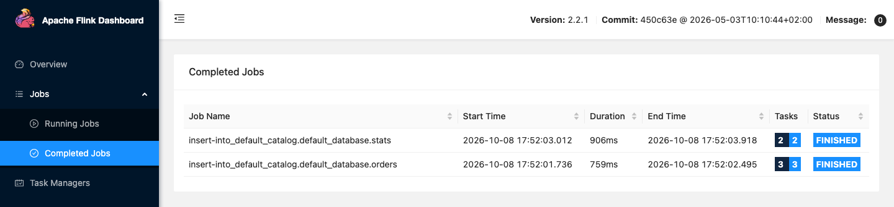

# Flink SQL: Kafka to PostgreSQL

The `flink-lite` profile runs a Flink JobManager, one TaskManager and the SQL Gateway. `flink-full` runs three TaskManagers. Flink's connector jars for Kafka, Avro with the schema registry, JDBC and Iceberg come from the shared volume that the `deps` profile fills. The commands below come from the end-to-end tests, which run them on every release, with the names changed.

This guide reads Avro records from Kafka through the Karapace schema registry and writes an aggregate to PostgreSQL over JDBC. [Ingest into Iceberg](iceberg-ingestion.md) shows Flink writing an Iceberg table.

```bash
odctl up flink-lite kafka-lite
```

`flink-lite` starts PostgreSQL itself, because it depends on the Iceberg catalog, which keeps its metadata there.

| Endpoint | Address |
| --- | --- |
| Flink UI and REST API from the host | `http://127.0.0.1:8082` |
| SQL Gateway REST API from the host | `http://127.0.0.1:8084` |
| Flink REST API inside the `odctl` network | `http://jobmanager:8081` |
| SQL Gateway inside the `odctl` network | `http://flink-sql-gateway:8083` |

## Create the topic and the target table

```bash
docker exec kafka /opt/kafka/bin/kafka-topics.sh --bootstrap-server broker-1:19092 \
  --create --if-not-exists --topic orders --partitions 1 --replication-factor 1

docker exec postgres psql -U user -d odctl -c "
  CREATE TABLE supplier_stats (supplier TEXT PRIMARY KEY, orders BIGINT, total DOUBLE PRECISION);"
```

## Run the SQL

Open the SQL client in the JobManager container:

```bash
docker exec -it flink-jobmanager /opt/flink/bin/sql-client.sh
```

```sql
SET 'execution.runtime-mode' = 'batch';
SET 'table.dml-sync' = 'true';
CREATE TABLE orders (supplier STRING, price DOUBLE) WITH ('connector'='kafka','topic'='orders','properties.bootstrap.servers'='broker-1:19092','scan.startup.mode'='earliest-offset','scan.bounded.mode'='latest-offset','format'='avro-confluent','avro-confluent.url'='http://karapace:8081');
INSERT INTO orders VALUES ('a', 10.0), ('a', 5.0), ('b', 7.5);
CREATE TABLE stats (supplier STRING, orders BIGINT, total DOUBLE, PRIMARY KEY (supplier) NOT ENFORCED) WITH ('connector'='jdbc','url'='jdbc:postgresql://postgres:5432/odctl','table-name'='supplier_stats','username'='user','password'='password');
INSERT INTO stats SELECT supplier, COUNT(*), SUM(price) FROM orders GROUP BY supplier;
```

The first `INSERT` writes three Avro records to Kafka and registers their schema in Karapace. The second reads them back, groups them by supplier and writes the result to PostgreSQL. `scan.bounded.mode` set to `latest-offset` makes the Kafka source stop at the end of the topic, so the batch job finishes. Leave it out and set `execution.runtime-mode` to `streaming` for a job that keeps running.

Right after Kafka starts, Karapace can answer its health check and still time out on a schema write for a short while. If the first `INSERT` fails on the schema registry, run it again.

## Check the result

```bash
docker exec postgres psql -U user -d odctl -c "SELECT * FROM supplier_stats ORDER BY supplier"
```

Supplier `a` has 2 orders totalling 15, and supplier `b` has 1 order totalling 7.5. The Flink UI at `http://127.0.0.1:8082` shows the jobs the SQL client submitted.

The two `INSERT` statements run as two batch jobs, listed under Completed Jobs.

{ .screenshot }

## From another container

Inside the `odctl` network, Flink's REST API is `http://jobmanager:8081` and the SQL Gateway is `http://flink-sql-gateway:8083`. In Flink SQL, Kafka is `broker-1:19092`, Karapace is `http://karapace:8081` and PostgreSQL is `jdbc:postgresql://postgres:5432/odctl`.
