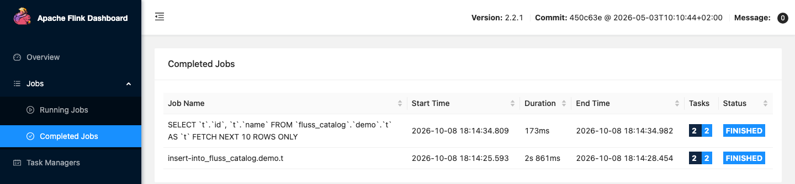

# Fluss

The `fluss` profile runs Apache Fluss 1.0.0: a coordinator server, one tablet server and the ZooKeeper they register in. Flink reads and writes Fluss tables through the Fluss catalog, whose client jar comes from the shared volume that the `deps` profile fills. The commands below come from the end-to-end tests, which run them on every release, with the names changed.

```bash
odctl up fluss flink-lite
```

| Endpoint | Address |
| --- | --- |
| Coordinator inside the `odctl` network | `fluss-coordinator:9123` |
| Tablet server inside the `odctl` network | `fluss-tablet-1:9123` |

The coordinator is also published on `127.0.0.1:9123` and the tablet server on `127.0.0.1:9124`. Both advertise their container names, which resolve only inside the `odctl` network, so run Fluss clients in a container, such as Flink.

## Check the cluster formed

The servers register in ZooKeeper once they are up. List the tablet servers and read the active coordinator:

```bash
docker exec fluss-zookeeper zkCli.sh -server localhost:2181 ls /fluss/tabletservers/ids
docker exec fluss-zookeeper zkCli.sh -server localhost:2181 get /fluss/coordinators/active
```

The first prints `[0]`, the id of the one tablet server. The second names `fluss-coordinator:9123`.

## Write and read a table with Flink SQL

```bash
docker exec -it flink-jobmanager /opt/flink/bin/sql-client.sh
```

```sql
SET 'execution.runtime-mode' = 'batch';
SET 'table.dml-sync' = 'true';
SET 'sql-client.execution.result-mode' = 'tableau';
CREATE CATALOG fluss_catalog WITH ('type' = 'fluss', 'bootstrap.servers' = 'fluss-coordinator:9123');
CREATE DATABASE IF NOT EXISTS fluss_catalog.demo;
CREATE TABLE fluss_catalog.demo.t (id BIGINT, name STRING, PRIMARY KEY (id) NOT ENFORCED);
INSERT INTO fluss_catalog.demo.t VALUES (1, 'a'), (2, 'b'), (3, 'c');
SELECT * FROM fluss_catalog.demo.t LIMIT 10;
```

The `SELECT` returns the three rows.

Fluss keeps its data inside its containers, so `odctl down` removes it.

The Flink UI lists the two jobs:

{ .screenshot }

## From another container

Inside the `odctl` network, set a Fluss client's bootstrap servers to `fluss-coordinator:9123`.
