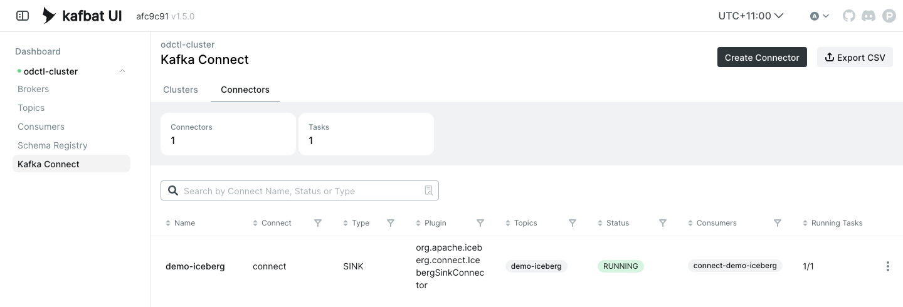

# Kafka Connect

Both Kafka profiles run one Kafka Connect worker, `connect`, beside the brokers. It loads its plugins from the shared volume that the `deps` profile fills, and you manage connectors through its REST API. The commands below come from the end-to-end tests, which run them on every release, with the names changed.

```bash
odctl up kafka-lite
```

| Setting | Value |
| --- | --- |
| REST API from the host | `http://127.0.0.1:8083` |
| REST API inside the `odctl` network | `http://connect:8083` |
| Plugin folder | `/mnt/shared-deps/connect` |
| Default converters | JSON with schemas, for keys and values |
| Offset flush interval | 10 seconds |

## Plugins

The `deps` image puts these connectors in the plugin folder: the Apache Iceberg sink, the Debezium PostgreSQL source, the ClickHouse sink, the Aiven JDBC connector, the Aiven S3 sink, the Redis connector and the MSK data generator. List the classes Connect has loaded:

```bash
curl -s http://127.0.0.1:8083/connector-plugins
```

The tests check that the list includes `org.apache.iceberg.connect.IcebergSinkConnector`, `io.debezium.connector.postgresql.PostgresConnector` and `com.clickhouse.kafka.connect.ClickHouseSinkConnector`. A plugin missing from the volume does not stop Connect from starting. It only leaves the class out of this list.

## Register a connector

A connector is a name and a `config` object, posted to `/connectors`. [Ingest into Iceberg](iceberg-ingestion.md) has a complete Iceberg sink configuration. Save it as `demo-iceberg.json` and post it:

```bash
curl -X POST -H 'Content-Type: application/json' \
  http://127.0.0.1:8083/connectors -d @demo-iceberg.json
```

The worker's default converters expect JSON with a schema envelope. A connector that reads plain JSON sets `"value.converter.schemas.enable": "false"` in its own config, as the Iceberg example does.

## Check and remove it

```bash
curl -s http://127.0.0.1:8083/connectors/demo-iceberg/status
curl -X DELETE http://127.0.0.1:8083/connectors/demo-iceberg
```

The status shows the connector and each task as `RUNNING` or `FAILED`, with the error for a failed task. The worker's log has the rest:

```bash
docker logs --tail 40 connect
```

Kafka UI lists the connector under Kafka Connect, Connectors:

{ .screenshot }

## PostgreSQL for Debezium

The `postgres` profile runs PostgreSQL with `wal_level=logical`. Its init script creates the `cdc` schema and the `cdc_pub` publication for every table in that schema, so a Debezium source can read changes to tables you create in `cdc`. Start both profiles to use it:

```bash
odctl up postgres kafka-lite
```

## From another container

Inside the `odctl` network, the REST API is `http://connect:8083`, and connectors reach the brokers at `broker-1:19092`, the catalog at `http://catalog:8181` and SeaweedFS at `http://seaweed:8333`.
