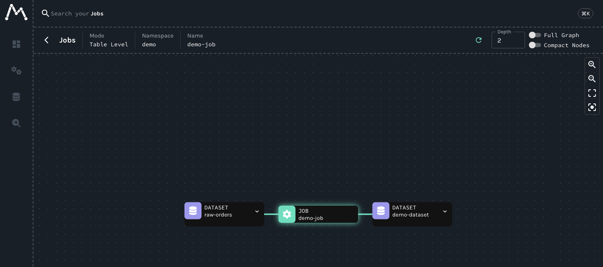

# OpenLineage and Marquez

The `lineage` profile runs Marquez 0.51.1: an API that receives OpenLineage events and keeps jobs, runs and datasets on PostgreSQL, and a web UI that draws the lineage graph. Anything that sends OpenLineage events over HTTP can report to it. The commands below come from the end-to-end tests, with the names changed.

```bash
odctl up lineage
```

| Endpoint | Address |
| --- | --- |
| Marquez API from the host | `http://127.0.0.1:5002` |
| Marquez API inside the `odctl` network | `http://marquez-api:5000` |
| Lineage graph UI | `http://127.0.0.1:3003` |

## Send OpenLineage events

A run is reported as a `START` event and a `COMPLETE` event with the same run id. The job reads one dataset and writes another:

```bash
RUN_ID=a1b2c3d4-0000-4000-8000-000000000001
NOW=$(date -u +%Y-%m-%dT%H:%M:%S.000Z)

for event in START COMPLETE; do
  curl -X POST http://127.0.0.1:5002/api/v1/lineage \
    -H 'Content-Type: application/json' \
    -d "{\"eventType\":\"$event\",\"eventTime\":\"$NOW\",
         \"producer\":\"demo\",
         \"run\":{\"runId\":\"$RUN_ID\"},
         \"job\":{\"namespace\":\"demo\",\"name\":\"demo-job\"},
         \"inputs\":[{\"namespace\":\"demo\",\"name\":\"raw-orders\"}],
         \"outputs\":[{\"namespace\":\"demo\",\"name\":\"demo-dataset\"}]}"
done
```

The run id is a UUID, as OpenLineage requires.

## Read the lineage back

```bash
curl http://127.0.0.1:5002/api/v1/namespaces
curl http://127.0.0.1:5002/api/v1/namespaces/demo/jobs/demo-job
curl http://127.0.0.1:5002/api/v1/namespaces/demo/datasets/demo-dataset
```

Marquez writes the job, the run and the dataset from the events, so all three read back. The UI shows them under the `demo` namespace.

The UI draws the job between the datasets it read and wrote:

{ .screenshot }

## From another container

Inside the `odctl` network, send events to `http://marquez-api:5000/api/v1/lineage`. For an OpenLineage client's HTTP transport, set the URL to `http://marquez-api:5000`, because the transport adds `api/v1/lineage` by default.
