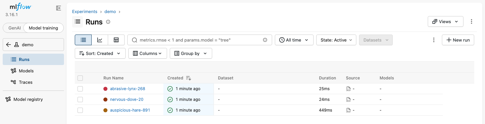
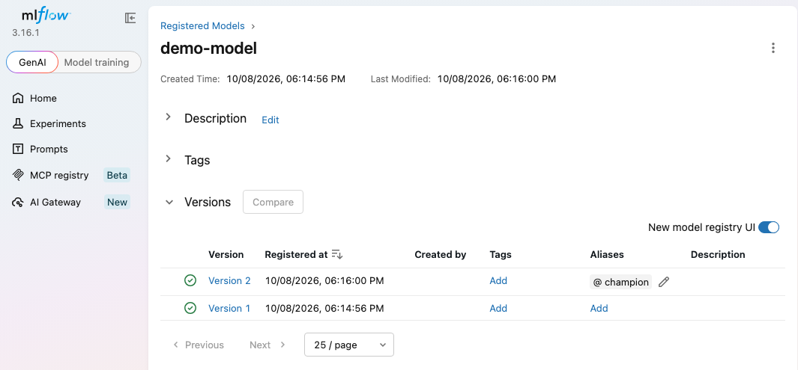

# MLflow tracking and model serving

The `mlflow` profile runs two containers. `mlflow` is the tracking server and model registry, with runs on PostgreSQL and artifacts on SeaweedFS under `s3://mlflow`. `mlflow-serve` scores a registered model over HTTP. The commands below come from the end-to-end tests, with the names changed.

```bash
odctl up mlflow
```

| Endpoint | Address |
| --- | --- |
| Tracking UI and API from the host | `http://127.0.0.1:5004` |
| Tracking API inside the `odctl` network | `http://mlflow:5000` |
| Model server from the host | `http://127.0.0.1:5003/invocations` |
| Model server inside the `odctl` network | `http://mlflow-serve:5003/invocations` |

The server runs MLflow 3.16.1, so install the same client version on the host.

## Log a run with an artifact

```python
import pathlib
import mlflow

mlflow.set_tracking_uri("http://127.0.0.1:5004")
mlflow.set_experiment("demo")

p = pathlib.Path("notes.txt")
p.write_text("hello")
with mlflow.start_run() as run:
    mlflow.log_param("k", "v")
    mlflow.log_metric("m", 1.0)
    mlflow.log_artifact(str(p))

print(mlflow.get_run(run.info.run_id).info.artifact_uri)
print([f.path for f in mlflow.MlflowClient().list_artifacts(run.info.run_id)])
```

The artifact URI starts with `mlflow-artifacts:/`. The server proxies artifacts, so the client uploads through the tracking server and needs no S3 address or keys. The run and its artifact appear in the UI.

The runs are listed under the experiment in the Model training view:

{ .screenshot }

## Register a model

```python
import mlflow, numpy as np, xgboost as xgb
from mlflow import MlflowClient

mlflow.set_tracking_uri("http://127.0.0.1:5004")
mlflow.set_experiment("demo-model")

X, y = np.array([[0.0], [1.0], [2.0], [3.0]]), np.array([0, 0, 1, 1])
with mlflow.start_run():
    model = xgb.XGBClassifier(n_estimators=5, max_depth=2).fit(X, y)
    mlflow.xgboost.log_model(model, name="model", registered_model_name="demo-model")

client = MlflowClient()
version = max(int(mv.version) for mv in client.search_model_versions("name='demo-model'"))
client.set_registered_model_alias("demo-model", "champion", version)
```

This needs XGBoost on the host. The model server has XGBoost 3.2, so install the same minor version to log a model it can load.

The registry lists each version, with the `champion` alias on the latest:

{ .screenshot }

## Serve the model

`mlflow-serve` starts with the profile and waits idle while `MODEL_URI` is empty. `MODEL_URI` is set in `.odctl/.env`, which `odctl init` writes. Change its line there to:

```bash
MODEL_URI="models:/demo-model@champion"
```

Then run `odctl up mlflow` again, so the container starts with the new value, and score two rows:

```bash
odctl up mlflow
curl -X POST http://127.0.0.1:5003/invocations \
  -H 'Content-Type: application/json' -d '{"inputs": [[0.0], [3.0]]}'
```

The response holds a `predictions` list, one per input row. Check the body rather than the status code, because the server answers 200 with an error payload when scoring fails. `http://127.0.0.1:5003/ping` answers once the model is loaded.

## From Airflow or another container

Inside the `odctl` network, set the tracking URI to `http://mlflow:5000` and score at `http://mlflow-serve:5003/invocations`. Extra Python packages for both MLflow containers go in `_MLOPS_PIP_DEPS` in `.odctl/.env`, followed by `odctl recreate mlflow`.
