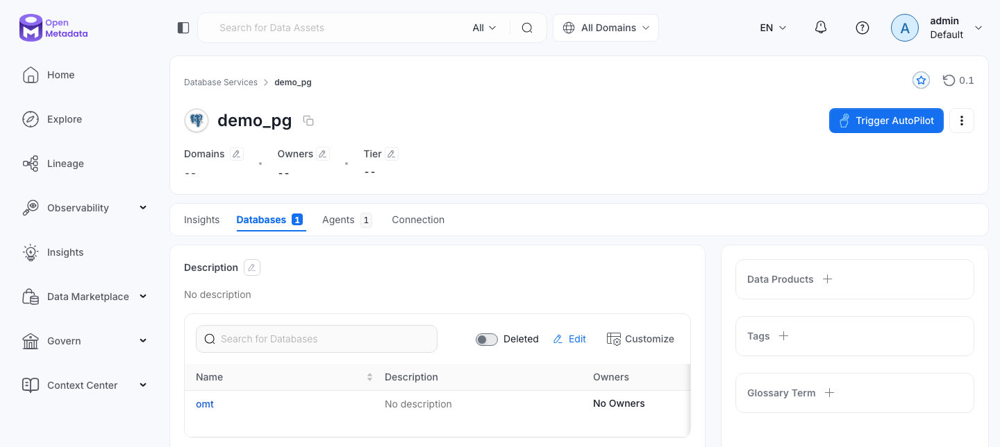

# Catalogue a database with OpenMetadata

The `metadata` profile runs OpenMetadata: the server with its UI and REST API, Elasticsearch for search, and an ingestion container, an Airflow that runs the ingestion pipelines the server deploys. Its own tables are in the `omt` database on PostgreSQL. The commands below come from the end-to-end tests, with the names changed.

```bash
odctl up metadata
```

| Endpoint | Address |
| --- | --- |
| UI and REST API from the host | `http://127.0.0.1:8585` |
| UI and REST API inside the `odctl` network | `http://openmetadata-server:8585` |
| Ingestion Airflow from the host | `http://127.0.0.1:8087` |

Log in as `admin@open-data.local` with the password `admin`. The domain is `open-data.local`, not the upstream default, and a wrong domain fails with an invalid password error.

## Get a token

The login API takes the password base64-encoded and returns a JWT:

```bash
TOKEN=$(curl -s -H 'Content-Type: application/json' \
  -d "{\"email\":\"admin@open-data.local\",\"password\":\"$(printf admin | base64)\"}" \
  http://127.0.0.1:8585/api/v1/users/login \
  | python3 -c 'import json,sys; print(json.load(sys.stdin)["accessToken"])')
AUTH="Authorization: Bearer $TOKEN"
```

## Register PostgreSQL as a database service

PostgreSQL is already running, so it serves as the source. The server reaches it by its container name:

```bash
SVC=$(curl -s -X PUT -H "$AUTH" -H 'Content-Type: application/json' \
  -d '{"name":"demo_pg","serviceType":"Postgres","connection":{"config":{"type":"Postgres","scheme":"postgresql+psycopg2","username":"user","authType":{"password":"password"},"hostPort":"postgres:5432","database":"omt"}}}' \
  http://127.0.0.1:8585/api/v1/services/databaseServices \
  | python3 -c 'import json,sys; print(json.load(sys.stdin)["id"])')
```

## Run a metadata ingestion

Create a pipeline, deploy it as a DAG into the ingestion Airflow, and trigger it:

```bash
PIPE=$(curl -s -X POST -H "$AUTH" -H 'Content-Type: application/json' \
  -d "{\"name\":\"demo_pg_metadata\",\"pipelineType\":\"metadata\",\"service\":{\"id\":\"$SVC\",\"type\":\"databaseService\"},\"sourceConfig\":{\"config\":{\"type\":\"DatabaseMetadata\"}},\"airflowConfig\":{\"startDate\":\"2026-01-01T00:00:00.000Z\"}}" \
  http://127.0.0.1:8585/api/v1/services/ingestionPipelines \
  | python3 -c 'import json,sys; print(json.load(sys.stdin)["id"])')

curl -s -X POST -H "$AUTH" http://127.0.0.1:8585/api/v1/services/ingestionPipelines/deploy/$PIPE
curl -s -X POST -H "$AUTH" http://127.0.0.1:8585/api/v1/services/ingestionPipelines/trigger/$PIPE
```

Airflow has to parse the new DAG file before the trigger works, so repeat the trigger every few seconds until it answers that the pipeline has been triggered. Then read the run's state:

```bash
curl -s -H "$AUTH" \
  "http://127.0.0.1:8585/api/v1/services/ingestionPipelines/name/demo_pg.demo_pg_metadata?fields=pipelineStatuses"
```

The first entry of `pipelineStatuses` reaches `success` when the tables are catalogued. They then appear in the UI under the `demo_pg` service.

{ .screenshot }

## Search the catalogue

Rebuild the search index, then query it:

```bash
curl -s -X POST -H "$AUTH" http://127.0.0.1:8585/api/v1/apps/trigger/SearchIndexingApplication
curl -s -H "$AUTH" "http://127.0.0.1:8585/api/v1/search/query?q=*&index=table_search_index&size=1"
```

`hits.total.value` counts the searchable tables.

## From another container

Inside the `odctl` network, call the API at `http://openmetadata-server:8585`. The server also answers the Model Context Protocol at `http://127.0.0.1:8585/mcp` with the same token.

## Remove the example

```bash
curl -s -X DELETE -H "$AUTH" \
  "http://127.0.0.1:8585/api/v1/services/databaseServices/name/demo_pg?hardDelete=true&recursive=true"
```
