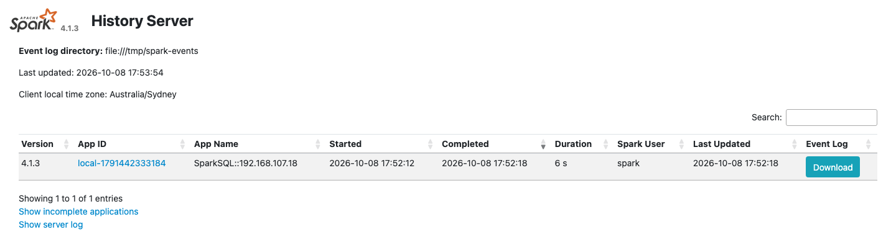
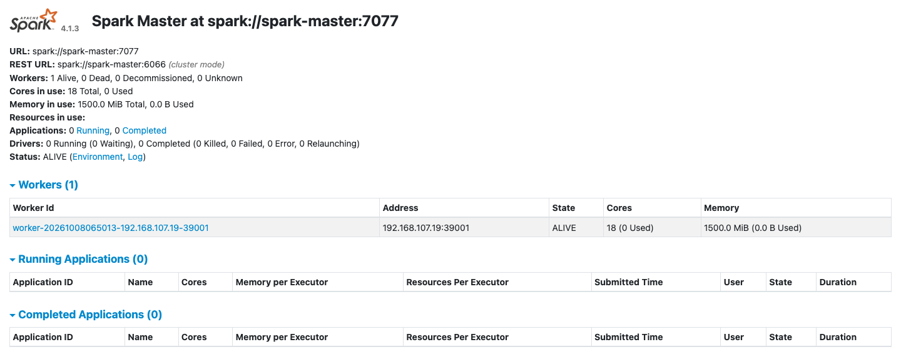

# Spark

The `spark-lite` profile runs a Spark master, one worker and the Spark History Server. `spark-full` runs three workers. Spark's default catalog is `iceberg`, already pointed at the Iceberg REST catalog, so `spark-sql` reads and writes Iceberg tables with no extra settings. The commands below come from the end-to-end tests, which run them on every release, with the names changed.

```bash
odctl up spark-lite
```

| Endpoint | Address |
| --- | --- |
| Spark master UI from the host | `http://127.0.0.1:9080` |
| Master URL from the host | `spark://127.0.0.1:7077` |
| Spark History Server from the host | `http://127.0.0.1:18080` |
| Master URL inside the `odctl` network | `spark://spark-master:7077` |
| Spark History Server inside the `odctl` network | `http://spark-history:18080` |

## Run SQL against Iceberg

```bash
docker exec spark-master /opt/spark/bin/spark-sql -e "
  CREATE NAMESPACE IF NOT EXISTS iceberg.demo;
  CREATE OR REPLACE TABLE iceberg.demo.t (id BIGINT) USING iceberg;
  INSERT INTO iceberg.demo.t VALUES (1),(2),(3);
  SELECT count(*) FROM iceberg.demo.t;"
```

The query prints `3`. The table is in the same catalog that Flink, Kafka Connect and Trino use, so [Ingest into Iceberg](iceberg-ingestion.md) shows the other engines writing to it.

## See finished applications

Every Spark application writes an event log to `/tmp/spark-events`, which all Spark containers share. List the logs:

```bash
docker exec spark-master ls /tmp/spark-events
```

The Spark History Server at `http://127.0.0.1:18080` reads the same directory, so the `spark-sql` run above appears there after it ends, with its jobs, stages and SQL plans. The master UI at `http://127.0.0.1:9080` shows the workers and the applications the master has run.

The event logs are on a volume held in memory, so `odctl down` removes them.

The History Server lists the `spark-sql` run:

{ .screenshot }

{ .screenshot }

## From another container

Inside the `odctl` network, submit applications to `spark://spark-master:7077`. Spark's settings, including the `iceberg` catalog and S3 access to SeaweedFS, are in `spark/spark-defaults.conf` in the workspace.
