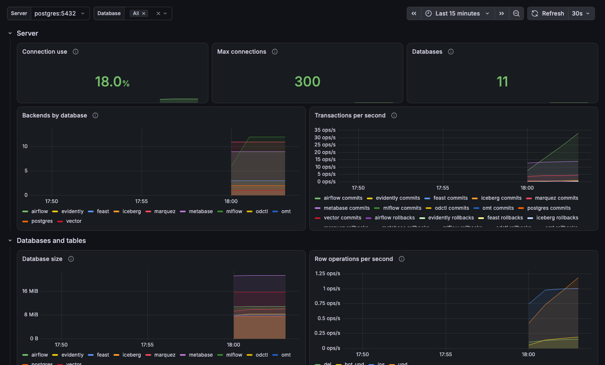

# Telemetry

The `telemetry` profile runs the grafana/otel-lgtm image: an OpenTelemetry Collector, Prometheus, Tempo, Loki and Grafana in one container. Start it next to the profiles you want to watch:

```bash
odctl up telemetry kafka-lite flink-lite
```

| Endpoint | Address |
| --- | --- |
| Grafana (user `user`, password `password`) | `http://127.0.0.1:3004` |
| Prometheus | `http://127.0.0.1:19090` |
| OTLP through the collector | `127.0.0.1:4317` (gRPC), `http://127.0.0.1:4318` (HTTP) |

## Where the metrics come from

Prometheus scrapes the services that publish a metrics endpoint, by container name on the `odctl` network. Airflow pushes its metrics over OTLP to the collector, and the collector reads PostgreSQL and Valkey directly. A service that is not running is simply a target that is down.

## Dashboards

Grafana has a dashboard per service in a folder named `odctl`. A dashboard fills in once its service's profile is up. The dashboards are JSON files in `.odctl/grafana/dashboards/`. Edit a file and run `odctl restart telemetry` to load it. Changes made in the Grafana UI are not kept.

For example, the PostgreSQL dashboard:

{ .screenshot }

## Send your own metrics

Point an OpenTelemetry SDK at `http://127.0.0.1:4318`, its default HTTP port. The end-to-end tests post one metric with curl, which shows the path:

```bash
ts=$(python3 -c "import time;print(int(time.time()*1e9))")
cat > /tmp/otlp.json <<JSON
{"resourceMetrics":[{"resource":{"attributes":[{"key":"service.name","value":{"stringValue":"demo"}}]},
"scopeMetrics":[{"scope":{"name":"demo"},"metrics":[{"name":"demo_total","unit":"1",
"sum":{"aggregationTemporality":2,"isMonotonic":true,"dataPoints":[
{"asDouble":42,"timeUnixNano":"${ts}","startTimeUnixNano":"${ts}","attributes":[]}]}}]}]}]}
JSON
curl -X POST -H "Content-Type: application/json" --data-binary @/tmp/otlp.json \
  http://127.0.0.1:4318/v1/metrics
curl "http://127.0.0.1:19090/api/v1/query?query=demo_total"
```

Prometheus also accepts OTLP metrics directly at `http://127.0.0.1:19090/api/v1/otlp/v1/metrics`.
