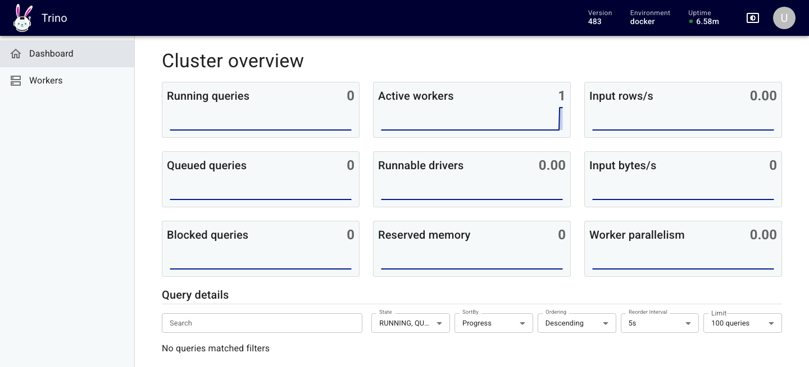
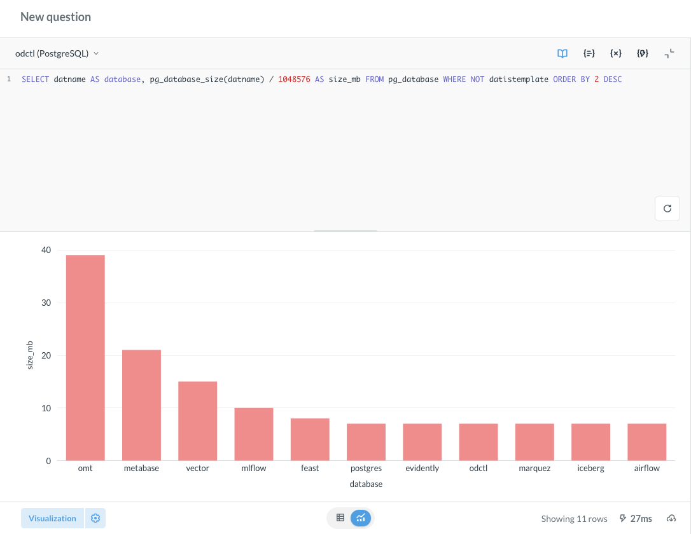

# Trino and Metabase

The `trino` profile runs Trino, which queries PostgreSQL, Iceberg, ClickHouse, Kafka and Valkey through one SQL interface. The `metabase` profile runs Metabase, which draws charts and dashboards over those databases. Metabase keeps its own settings and dashboards in PostgreSQL, so both profiles start `postgres`. The commands below come from the end-to-end tests, with the names changed.

```bash
odctl up trino metabase
```

| Endpoint | Address |
| --- | --- |
| Trino UI and JDBC from the host | `http://127.0.0.1:8080` |
| Metabase from the host | `http://127.0.0.1:3000` |

## Trino catalogs

```bash
docker exec trino trino --execute "SHOW CATALOGS"
```

| Catalog | Reads | Needs |
| --- | --- | --- |
| `postgres` | the `odctl` database | nothing more |
| `iceberg` | tables in the REST catalog, with files on SeaweedFS | `catalog` |
| `clickhouse` | the `feature_store` database on `ch-11` | `ch-lite` or `ch-full` |
| `kafka` | topics, with fields from the Karapace schema registry | `kafka-lite` or `kafka-full` |
| `valkey` | keys in Valkey | `valkey` |

Every catalog loads when Trino starts, even when its service is not running. A query against such a catalog fails until you start that profile. Catalogs finish loading after Trino's health endpoint starts answering, so `SHOW CATALOGS` can take a minute to list them all.

Run a query:

```bash
docker exec trino trino --execute "SELECT 1"
```

Trino has no password authentication, so it accepts any user name. `docker exec -it trino trino` connects as `trino`. Pass `--user user` to use the name the rest of the stack uses. [Workspace](../how-it-works.md#workspace) explains the access rules in `trino/rules.json`.

The Trino UI at `http://127.0.0.1:8080` asks only for a user name. It shows the cluster and the queries that ran in the last few minutes.

{ .screenshot }

## Metabase

Open `http://127.0.0.1:3000` and create the first admin account. Then add each database under Admin settings, Databases, with these settings:

| Database type | Host | Port | Other settings |
| --- | --- | --- | --- |
| PostgreSQL | `postgres` | `5432` | database `odctl`, user `user`, password `password` |
| ClickHouse | `ch-11` | `8123` | database `default`, user `default`, password `password`, no SSL |
| Starburst (for Trino) | `trino` | `8080` | catalog `postgres`, schema `public`, user `admin`, no SSL |

Metabase runs inside the `odctl` network, so it reaches each database by container name. Use the Starburst driver for Trino, because it is the Trino driver Metabase ships. It needs a catalog, and any catalog in the table above works.

Metabase takes a while to start. It is ready when this request succeeds:

```bash
curl http://127.0.0.1:3000/api/health
```

A SQL question on the PostgreSQL connection, shown as a bar chart:

{ .screenshot }

## From another container

Inside the `odctl` network, Trino is at `http://trino:8080` and Metabase at `http://metabase:3000`.
