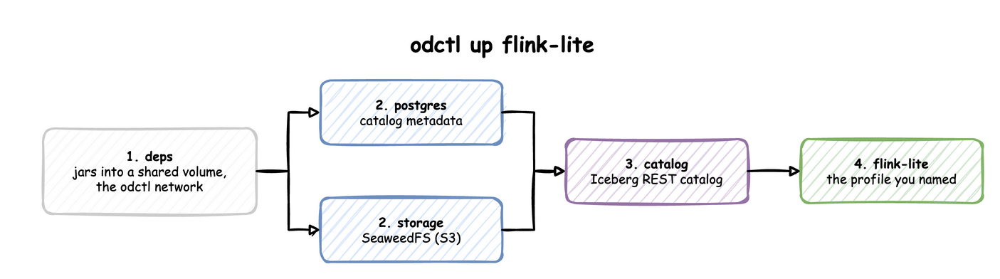

# How it works

## What `odctl up` does

Take `odctl up flink-lite` as an example. Flink keeps its tables in Iceberg, so it needs the Iceberg REST catalog. The catalog keeps its metadata in PostgreSQL and its files in SeaweedFS. All of them need the shared jars in `deps`.



odctl reads these links from `registry.yml` and starts the profiles from left to right:

1. `deps` copies connectors and jars into a shared Docker volume, creates the `odctl` network, and exits.
2. `postgres` and `storage` start, and odctl waits until they are healthy.
3. `catalog` starts once both are healthy.
4. `flink-lite` starts last.

`odctl up flink-lite --dry-run` prints this plan without starting anything. Each [profile page](profiles/index.md) lists what its profile also starts.

`down`, `ps`, `logs`, `restart` and `recreate` act only on the profiles you name. `odctl down flink-lite` stops Flink and leaves PostgreSQL, SeaweedFS and the catalog running for other profiles.

## How you reach a service

Every service publishes its ports on the host, so a browser or client on your machine uses `http://127.0.0.1:<port>`. Docker publishes them on all of the host's network interfaces, so other machines on your network can reach them too. Each profile page lists the ports.

Inside Docker, services reach each other by container name on the `odctl` network, for example `http://catalog:8181` or `broker-1:19092` for Kafka. A container of your own reaches them the same way when it joins that network:

```bash
docker run --rm --network odctl curlimages/curl http://catalog:8181/v1/config
```

## Where data lives

Services keep their data inside their containers.

| Command | Containers | Your data |
| --- | --- | --- |
| `odctl restart` | kept | kept |
| `odctl recreate` | replaced | lost |
| `odctl down` | removed | lost |
| `odctl down --volumes` | removed, with the `odctl-shared-deps` volume | lost |

So a database, a bucket, a topic or an Iceberg table lasts until the profile is stopped. This keeps every `odctl up` a clean start. The `odctl-shared-deps` volume holds only jars, so keeping it makes the next start faster.

## Which images run

Most services run their project's official image, pinned to an exact version. odctl builds five images of its own and publishes them to `ghcr.io/jaehyeon-kim/odctl/`:

| Image | Contents |
| --- | --- |
| `deps` | Connectors, jars and the Prometheus JMX agent, including the Iceberg REST catalog and the Kafka Connect Iceberg sink |
| `postgres` | PostgreSQL 18 with pgvector, pg_textsearch and PostGIS |
| `airflow` | Airflow with the MLflow and Feast clients and the model runtimes |
| `mlflow` | The MLflow server and model server with the model runtimes |
| `spark` | Spark with the Python clients jobs use |

These five are tagged with the CLI version through `TAG`. [Workspace](#workspace) explains how `TAG` is set with and without `odctl init`.

## Workspace

odctl runs from one of two places: the files bundled with the CLI, or a workspace that `odctl init` copies them into.

### With and without `odctl init`

| | Without a workspace | With a workspace |
| --- | --- | --- |
| Files odctl reads | the compose files and `registry.yml` inside the installed package | the copies in `.odctl` in the current directory |
| Image tag of odctl's own images | `latest`, because no `.env` sets `TAG` | the CLI version, written to `.odctl/.env` as `TAG` |
| Your changes | none; the package is replaced on every upgrade | any file in `.odctl` |
| After a CLI upgrade | new files and images at once | the old files and images, with a warning on every command until `odctl init --force` |

Without a workspace, `latest` can be newer than the CLI you run, so use `odctl init` for anything you want to repeat. A `TAG` set in the shell overrides both.

odctl looks for `.odctl` in the current directory. `--workspace PATH` points it at another directory, so one workspace can serve several projects.

### Customise it

`odctl init` copies everything odctl runs into `.odctl`. It copies only files that are missing, so running it again keeps your edits.

| File | What to change |
| --- | --- |
| `compose-*.yml` | Host ports, memory limits and environment variables of each service |
| `registry.yml` | The profiles, their compose files and their dependencies |
| `.env` | `TAG`, extra Python packages for Airflow (`_AIRFLOW_PIP_DEPS`) and the MLflow services (`_MLOPS_PIP_DEPS`), and the model the MLflow model server serves (`MODEL_URI`) |
| `grafana/dashboards/` | The Grafana dashboard for each service |
| `trino/rules.json` | Trino's file-based access control |
| `evidently/config.yaml` | The Evidently server's settings |

### Apply a change

A restart keeps the container, so it does not apply an edited compose file or `.env`. Run `odctl recreate <profile>` to replace the profile's containers from their current definition, and add `--pull` to fetch images again. Recreating discards the data in those containers. `odctl restart <profile>` is enough for files a service reads when it starts, such as `trino/rules.json` and the Grafana dashboards.

### Examples

Each example edits the workspace, then applies the change. `sed -i.bak` works with both GNU and macOS `sed`, and keeps the original as a `.bak` file.

Give SeaweedFS 2 GB instead of 512 MB, for example when several projects share it:

```bash
sed -i.bak '/^  seaweed:/,/^  [a-z]/ s/mem_limit: 512m/mem_limit: 2g/' .odctl/compose-infra.yml
odctl recreate storage
docker inspect seaweed --format '{{.HostConfig.Memory}}'   # 2147483648
```

Publish Trino on port 8180 instead of 8080, when another program already uses 8080:

```bash
sed -i.bak 's/"8080:8080" # Trino/"8180:8080" # Trino/' .odctl/compose-analytics.yml
odctl up trino
docker port trino   # 8080/tcp -> 0.0.0.0:8180
```

Install extra Python packages in the Airflow container, for DAGs that import them:

```bash
sed -i.bak 's/^_AIRFLOW_PIP_DEPS=.*/_AIRFLOW_PIP_DEPS="dateparser==1.4.3"/' .odctl/.env
odctl up airflow
docker exec airflow python -c "import dateparser"
```

The packages install when the container starts, so the first start after the change takes longer. `_MLOPS_PIP_DEPS` does the same for the `mlflow` and `mlflow-serve` containers, for example a library a served model needs to load. `MODEL_URI` in the same file sets the model `mlflow-serve` serves, as [MLflow tracking and model serving](guides/mlflow.md) shows.

### Trino access rules

The shipped `trino/rules.json` grants every identity full table privileges and denies `analyst` schema ownership. Add your own table rules there for row filtering and column masking, then restart Trino.

### Start again

`odctl init --force` deletes `.odctl` and copies the bundled files again, with `TAG` set to the current CLI version. Your edits are lost, so it asks for confirmation first.
