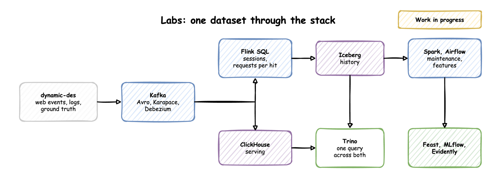

# Labs

Work in progress. A series of labs takes one generated dataset of web events and logs for five tenants through Kafka, Flink, ClickHouse, Spark, Trino and the MLOps tools, each lab building on the one before. The code will be in [benchtop](https://github.com/jaehyeon-kim/benchtop), and each lab will be listed here as it is published.

Until then, the [guides](guides/kafka.md) show each technology on its own.
